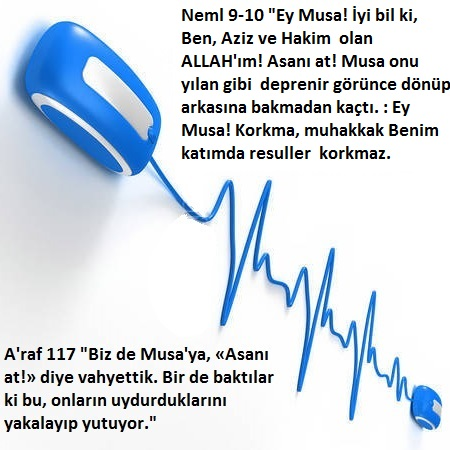

Rahman ve Rahim olan ALLAH'ın Adıyla ;

SUBHANALLAH! MAŞALLAH! LA KUVVETE İLLA BİLLAH! ELHAMDÜLİLLAH! ŞÜKÜRLER OLSUN ALLAH'A!

A Blessed [Scripture](https://Oku.FurkanHikmet.com) :

Simple To Understand!

Impossible to [Imitate](https://www.youtube.com/watch?v=vX3riVsnzqA) !

Over [Oku.FurkanHikmet.com](https://Oku.FurkanHikmet.com) is 19 ! ( [74:30](https://www.youtube.com/watch?v=vX3riVsnzqA) )

İŞTE 99 durumda 1/19^100 ‘den düşük ihtimalli 19 Mucizesi :

+ : var

_ : yok

|| : ya da

________________________________

Hicr 87 "Andolsun ki, biz sana 2. kez, tekrarlanan yediyi ve yüce Kur'an'ı verdik."

_______________ 1- [elm] _______________

(+++) Sayfa 7 - Bilim (tüm satırlar ilk satır da dahil) > Toplam 1786 adet E, L ve M Harfi İçerir Yani Tam 19 x 94 Tane !

(++_) Sayfa 8 - Namaz (3. satır hariç) > Toplam 551 adet E, L ve M Harfi İçerir Yani Tam 19 x 29 Tane !

(___) Sayfa 15 - Kimyager (ilk üç satır hariç) > Toplam 741 adet E, L ve M Harfi İçerir Yani Tam 19 x 39 Tane !

(_+_ || +__) Sayfa 16 - Diriliş (3. satır ile (2. ya da 1.) satır hariç) > Toplam 1596 adet E, L ve M Harfi İçerir Yani Tam 19 x 84 Tane !

(+++ || __+) Sayfa 18 - Şahit (tüm satırlar dahil zaten ilk 2 satır E veya L veya M harfi içermiyor) > Toplam 969 adet E, L ve M Harfi İçerir Yani Tam 19 x 51 Tane !

_______________ 2- [elms] _______________

Sayfa 1 - Emir (ilk 3 satır hariç) > Toplam 855 adet E, L, M ve S Harfi İçerir Yani Tam 19 x 45 Tane !

Sayfa 6 - Müslüman (2. ve 3. satır hariç) > Toplam 646 adet E, L, M ve S Harfi İçerir Yani Tam 19 x 34 Tane !

Sayfa 8 - Namaz (2. satır hariç) > Toplam 627 adet E, L, M ve S Harfi İçerir Yani Tam 19 x 33 Tane !

Sayfa 10 - Hikmet (3. satır hariç) > Toplam 1425 adet E, L, M ve S Harfi İçerir Yani Tam 19 x 75 Tane !

Sayfa 11 - İstanbul (2. satır hariç) > Toplam 1140 adet E, L, M ve S Harfi İçerir Yani Tam 19 x 60 Tane !

Sayfa 12 - Çağrı (ilk satır hariç zaten 2. satır da E veya L veya M veya S harfi içermiyor) > Toplam 1045 adet E, L, M ve S Harfi İçerir Yani Tam 19 x 55 Tane !

Sayfa 15 - Kimyager (2. ve 3. satır hariç) > Toplam 836 adet E, L, M ve S Harfi İçerir Yani Tam 19 x 44 Tane !

Sayfa 17 - Bilge (2. satır hariç) > Toplam 665 adet E, L, M ve S Harfi İçerir Yani Tam 19 x 35 Tane !

Sayfa 20 - Rahim (3. satır hariç) > Toplam 3876 adet E, L, M ve S Harfi İçerir Yani Tam 19 x 204 Tane !

Sayfa 21 - Mele-i Ala (ilk satır hariç) > Toplam 456 adet E, L, M ve S Harfi İçerir Yani Tam 19 x 24 Tane !

_______________ 3- [elr] _______________

Sayfa 1 - Emir (ilk 3 satır hariç) > Toplam 950 adet E, L ve R Harfi İçerir Yani Tam 19 x 50 Tane !

Sayfa 6 - Müslüman (ilk satır ya da 2. satır hariç) > Toplam 741 adet E, L ve R Harfi İçerir Yani Tam 19 x 39 Tane !

Sayfa 7 - Bilim (ilk üç satır hariç) > Toplam 2147 adet E, L ve R Harfi İçerir Yani Tam 19 x 113 Tane !

Sayfa 10 - Hikmet (ilk satır ya da 2. satır hariç) > Toplam 1520 adet E, L ve R Harfi İçerir Yani Tam 19 x 80 Tane !

Sayfa 14 - Beyin > Toplam 2261 adet E, L ve R Harfi İçerir Yani Tam 19 x 119 Tane !

Sayfa 15 - Kimyager (3. satır ile (birinci ya da 2. satırlar) hariç) > Toplam 969 adet E, L ve R Harfi İçerir Yani Tam 19 x 51 Tane !

Sayfa 19 - Emanet (3. satır ile (birinci ya da 2. satırlar) hariç) > Toplam 1140 adet E, L ve R Harfi İçerir Yani Tam 19 x 60 Tane !

Sayfa 20 - Rahim > Toplam 4332 adet E, L ve R Harfi İçerir Yani Tam 19 x 19 x 12 Tane !

_______________ 4- [elmr] _______________

Sayfa 1 - Emir (ilk üç satır hariç) > Toplam 1045 adet E, L, M ve R Harfi İçerir Yani Tam 19 x 55 Tane !

Sayfa 3 - Öğretmen (sadece 3. satır hariç) > Toplam 722 adet E, L, M ve R Harfi İçerir Yani Tam 19 x 19 + 19 x 19 Tane !

Sayfa 8 - Namaz (birinci satır ya da 3. satır hariç) > Toplam 741 adet E, L, M ve R Harfi İçerir Yani Tam 19 x 39 Tane !

Sayfa 13 - Musa (birinci satır ya da 2. satır hariç) > Toplam 3553 adet E, L, M ve R Harfi İçerir Yani Tam 19 x 187 Tane !

_______________ 5- [khyas] _______________

Sayfa 5 - Kul (ilk 3 satır hariç) > Toplam 1026 adet K, H, Y, A ve S Harfi İçerir Yani Tam 19 x 54 Tane !

Sayfa 9 - Çınar > Toplam 2280 adet K, H, Y, A ve S Harfi İçerir Yani Tam 19 x 19 + 1919 Tane !

Sayfa 12 - Çağrı (1. ve 3. satırlar hariç) > Toplam 1045 adet K, H, Y, A ve S Harfi İçerir Yani Tam 19 x 55 Tane !

Sayfa 16 - Diriliş > Toplam 1729 adet K, H, Y, A ve S Harfi İçerir Yani Tam 19 x 91 Tane !

_______________ 6- [th] _______________

Sayfa 9 - Çınar (zaten ilk 2 satır hiç T veya H harfi içermiyor) > Toplam 551 adet T ve H Harfi İçerir Yani Tam 19 x 29 Tane !

Sayfa 10 - Hikmet (1. Satır-ana başlık Hariç) > Toplam 266 adet T ve H Harfi İçerir Yani Tam 19 x 14 Tane !

Sayfa 13 - Musa (zaten ilk 2 satır hiç T veya H harfi içermiyor) > Toplam 627 adet T ve H Harfi İçerir Yani Tam 19 x 33 Tane !

Katsayılar Toplamı: 29 + 14 + 33 = 76 = 19 x 4

_______________ 7- [tsm] _______________

Sayfa 2 - Müjde (2. satır hariç) > Toplam 437 adet T, S ve M Harfi İçerir Yani Tam 19 x 23 Tane !

Sayfa 3 - Öğretmen (2. ya da 3. satır hariç) > Toplam 266 adet T, S ve M Harfi İçerir Yani Tam 19 x 14 Tane !

Sayfa 5 - Kul (ilk satır hariç) > Toplam 475 adet T, S ve M Harfi İçerir Yani Tam 19 x 25 Tane !

Sayfa 6 - Müslüman (ilk iki satır hariç) > Toplam 266 adet T, S ve M Harfi İçerir Yani Tam 19 x 14 Tane !

Sayfa 13 - Musa (ilk üç satır hariç) > Toplam 1121 adet T, S ve M Harfi İçerir Yani Tam 19 x 59 Tane !

_______________ 8- [ts] _______________

Sayfa 6 - Müslüman (sadece 2. satır hariç) > Toplam 190 adet T ve S Harfi İçerir Yani Tam 19 x 10 Tane !

_______________ 9- [ys] _______________

Sayfa 9 - Çınar (ilk satır hariç ve zaten 2. satır da Y veya S harfi içermiyor) > Toplam 475 adet Y ve S Harfi İçerir Yani Tam 19 x 25 Tane !

Sayfa 10 - Hikmet (İlk 3 Satır Hariç) > Toplam 342 adet Y ve S Harfi İçerir Yani Tam 19 x 18 Tane !

Sayfa 15 - Kimyager (tüm satırlar ve ilk satır da dahil) > Toplam 209 adet Y ve S Harfi İçerir Yani Tam 19 x 11 Tane !

Sayfa 19 - Emanet (ilk satır hariç ve zaten 2. satır da Y veya S harfi içermiyor) > Toplam 247 adet Y ve S Harfi İçerir Yani Tam 19 x 13 Tane !

_______________ 10- [s] _______________

Sayfa 1 - Emir (İlk satır da hepsi dahil) > 95 adet S Harfi İçerir Yani Tam 19 x 5 Tane !

Sayfa 14 - Beyin (İlk satır da hepsi dahil) > 247 adet S Harfi İçerir Yani Tam 19 x 13 Tane !

_______________ 11- [hm] _______________

Sayfa 4 - Zikir (ilk üç satır veya 3. satır hariç) > Toplam 152 adet H ve M Harfi İçerir Yani Tam 19 x 8 Tane !

Sayfa 6 - Müslüman (ilk satır ya da 2. satır hariç) > Toplam 133 adet H ve M Harfi İçerir Yani Tam 19 x 7 Tane !

Sayfa 13 - Musa (ilk 2 satır hariç) > Toplam 608 adet H ve M Harfi İçerir Yani Tam 19 x 32 Tane !

_______________ 12- [ask] _______________

Sayfa 4 - Zikir > Toplam 627 adet A, S ve K Harfi İçerir Yani Tam 19 x 33 Tane !

Sayfa 9 - Çınar (ilk satır hariç) > Toplam 1881 adet A, S ve K Harfi İçerir Yani Tam 19 x 99 Tane !

Sayfa 10 - Hikmet (ilk satır hariç) > Toplam 1140 adet A, S ve K Harfi İçerir Yani Tam 19 x 60 Tane !

Sayfa 12 - Çağrı (ilk 3 satır hariç) > Toplam 855 adet A, S ve K Harfi İçerir Yani Tam 19 x 45 Tane !

Sayfa 13 - Musa (2. satır hariç) > Toplam 2394 adet A, S ve K Harfi İçerir Yani Tam 19 x 126 Tane !

Sayfa 16 - Diriliş (1. satır hariç) > Toplam 1311 adet A, S ve K Harfi İçerir Yani Tam 19 x 69 Tane !

Sayfa 17 - Bilge (1. satır hariç) > Toplam 513 adet A, S ve K Harfi İçerir Yani Tam 19 x 27 Tane !

Sayfa 18 - Şahit (3. satır hariç) > Toplam 931 adet A, S ve K Harfi İçerir Yani Tam 19 x 49 Tane !

Sayfa 19 - Emanet (1. satır hariç) > Toplam 760 adet A, S ve K Harfi İçerir Yani Tam 19 x 40 Tane !

Sayfa 20 - Rahim > Toplam 3040 adet A, S ve K Harfi İçerir Yani Tam 19 x 160 Tane !

_______________ 13- [k] _______________

Sayfa 11 - İstanbul (zaten ilk 3 satır hiç k harfi içermiyor) > 228 Adet K Harfi İçerir Yani Tam 19 x 12 Tane !

Sayfa 4 - Zikir (1. Satır-ana başlık Hariç) > 152 K harfi içerir Tam 19 x 8 Tane!

Kaf Kuran’ı Simgeler : 11 ve 4. sayfalarda 'K' mevcut ve Kuran 114 Sure !

_______________ 14- [n] _______________

Sayfa 8 - Namaz (İlk satır hariç) > 247 adet N Harfi İçerir Yani Tam 19 x 13 Tane !

Sayfa 9 - Çınar (ilk 2 satır hariç) > 893 adet N Harfi İçerir Yani Tam 19 x 47 Tane !

Sayfa 16 - Diriliş (zaten ilk 2 satır hiç n harfi içermiyor) > 570 Adet N Harfi İçerir Yani Tam 19 x 30 Tane !

## TUFANDAN ÖNCE: -Ey Müdessir KALK VE [UYAR](https://www.youtube.com/watch?v=0c9Z5YAGZn4)!- "FURKAN HİKMET’İN ÜZERİNDE 19 VAR! & KIYAMET SAATİ!" [4K] > [youtu.be/0c9Z5YAGZn4](https://www.youtube.com/watch?v=0c9Z5YAGZn4)

## [Onurlu Kuran 11:13](http://OnurluKuran.com/11#13) "Onu o uydurdu" mu diyorlar? De : "Haydi ona benzer, uydurulmuş on sure getirin. ALLAH'tan başka tüm dostlarınızı da çağırın, doğru sözlülerseniz!"

## [Onurlu Kuran 11:14](http://OnurluKuran.com/11#14) Size cevap veremedilerse bilesiniz ki o, ALLAH'ın bilgisiyle indirilmiştir ve O'ndan başka ilah yoktur. Artık Müslüman olacak mısınız?

## [Onurlu Kuran 20:61](http://OnurluKuran.com/20#61) Dedi onlara Musa: “Vay size, uydurmayın ALLAH’a karşı yalan! Artık keser sizi azapla! Ve Kesinlikle heba olur iftira eden kimse!”

## 76:27.
Onlar acele olanı seviyorlar ve önlerindeki ağır günü arkalarında bırakıyorlar.

اِنَّ هٰٓؤُ۬لَٓاءِ يُحِبُّونَ الْعَاجِلَةَ وَيَذَرُونَ وَرَٓاءَهُمْ يَوْماً ثَق۪يلاً

İnne haulai yuhıbbunel acilete ve yezerune veraehum yevmen sekila.

## 76:28.
Onları Biz yarattık. Yaratılışlarını sapasağlam yaptık. Dilersek onları yok eder, yerlerine benzerlerini getiririz.

نَحْنُ خَلَقْنَاهُمْ وَشَدَدْنَٓا اَسْرَهُمْۚ وَاِذَا شِئْنَا بَدَّلْـنَٓا اَمْثَالَهُمْ تَبْد۪يلاً

Nahnu halaknahum ve şededna esrehum, ve iza şi'na beddelna emsalehum tebdila.

## 76:29.
Bu bir öğüttür. Artık dileyen onunla RABBİ'ne varan bir yol edinir.

اِنَّ هٰذِه۪ تَذْكِرَةٌۚ فَمَنْ شَٓاءَ اتَّخَذَ اِلٰى رَبِّه۪ سَب۪يلاً

İnne hazihi tezkireh, fe men şaettehaze ila rabbihi sebila.

## 76:30.
ALLAH dilemedikçe siz dileyemezsiniz. Kuşkusuz ALLAH, Her Şeyi Bilen'dir, En İyi Hüküm Veren'dir.

وَمَا تَشَٓاؤُ۫نَ اِلَّٓا اَنْ يَشَٓاءَ اللّٰهُۜ اِنَّ اللّٰهَ كَانَ عَل۪يماً حَك۪يماًۗ

Ve ma teşaune illa en yeşaallah, innallahe kane alimen hakima.

## 76:31.
Hak edeni rahmetine alır. Zalimler için ise acıklı bir azap hazırladı.

يُدْخِلُ مَنْ يَشَٓاءُ ف۪ي رَحْمَتِه۪ۜ وَالظَّالِم۪ينَ اَعَدَّ لَهُمْ عَذَاباً اَل۪يماً

Yudhilu men yeşau fi rahmetih, vez zalimine eadde lehum azaben elima.

[Onurlu Kuran 23:28](http://OnurluKuran.com/23#28) "Sen ve beraberindekiler gemiye yerleştiğinizde, ‘Bizi o zalim halktan kurtaran ALLAH'a övgüler olsun,' de."

[Oku.FurkanHikmet.com/1](http://Oku.FurkanHikmet.com/1)

[Furkan Hikmet 1:7](http://Oku.FurkanHikmet.com/1#7)- O halde gemiyi yap, sana gelmiş olanın Nuh'a da geldiğinden ve Nuh’un yaptığı geminin, senin bildirdiğinden bir farkı yoktur. Nuh’a vahyettiğimiz, kuşkusuz senin içinde geçerlidir. Zalimler için Bana başvurma ve cahillerden olma!

[Sayfa 1 - EMİR](http://Oku.FurkanHikmet.com/1)
 
EMİR 
 
Rahman ve Rahim olan ALLAH’ın adıyla; 

[1](http://Oku.FurkanHikmet.com/1#1)- Hamd, ceza gününün Malikine, Selam’da seçkin kıldığı kullarınadır. 

[2](http://Oku.FurkanHikmet.com/1#2)- Hiç kuşkusuz sen, gönderilenlerdensin. 
 
[3](http://Oku.FurkanHikmet.com/1#3)- Doğru yol üzerindesin. 
 
[4](http://Oku.FurkanHikmet.com/1#4)- Yoldan çıkan topluluğu, azap’tan önce uyarmak ve ALLAH’ın yoluna ulaştırmak için gönderildin. 
 
[5](http://Oku.FurkanHikmet.com/1#5)- Azabın vakti yaklaşmadıkça, Rabbin içlerinden uyarması için birini gönderecek değildi. Ancak süresi tayin edilen o vakit, yakınlaştıkça yakınlaşmıştır. 
 
[6](http://Oku.FurkanHikmet.com/1#6)- Her kişi için belirlenen bir süre olduğu gibi, her toplum için de belirlenen bir süre vardır. 
 
[7](http://Oku.FurkanHikmet.com/1#7)- O halde gemiyi yap, sana gelmiş olanın Nuh'a da geldiğinden ve Nuh’un yaptığı geminin, senin bildirdiğinden bir farkı yoktur. Nuh’a vahyettiğimiz, kuşkusuz senin içinde geçerlidir. Zalimler için Bana başvurma ve cahillerden olma! 
 
[8](http://Oku.FurkanHikmet.com/1#8)- Kuşkusuz sana gelmeden önce, kitap nedir iman nedir bilmezdin. ALLAH, hidayet etmeseydi asla iman edeceklerden de değildin. Hamd, doğru yola eriştiren ALLAH’a dır. O, dilediğini seçer ve doğru yola eriştirir. 
 
[9](http://Oku.FurkanHikmet.com/1#9)- Sapkınlara gelince, onları ne sen saptırdın nede senin yaptıkların, ataları saptı ve kendilerinden sonra gelenleri de saptırdı.

[10](http://Oku.FurkanHikmet.com/1#10)- Kendisine doğru yol apaçık gelmişken, kendisine gerçek gelmişken, onu yalan sayandan ve kendisine gelen gerçekten yüz çevirenden daha zalim kimdir? 
 
[11](http://Oku.FurkanHikmet.com/1#11)- And olsun ki seni göndermeden önce azapla yakalamış olsaydık “Bize de bir uyarıcı gönderilseydi de, uyduğumuz yolun yanlış olduğunu anlasaydık ve ayetlerine iman etseydik Rabbimiz” derler ve kendilerine haksızlık edildiğini iddia ederlerdi. Rabbin, haksızlıktan münezzehtir, merhametlidir. 
 
[12](http://Oku.FurkanHikmet.com/1#12)- ALLAH kendisine ortak koşanları, başka ilahlar arayıp edinen kimseleri, doğru yola eriştirecek değildir. İnsanlar, bilgisizce ortak koşup dururlarken, nasıl doğru yola eriştirebilir? 
 
[13](http://Oku.FurkanHikmet.com/1#13)- O, zalim de değildir, herkes ancak kendi yapıp ettiğinin cezasını çeksin istemiştir. Adil’dir. 
 
[14](http://Oku.FurkanHikmet.com/1#14)- Doğrusu mükafat bakımından da ceza bakımından da Dünya hayatı, her türlü ekine hazır verimli bir toprak gibidir. 
 
[15](http://Oku.FurkanHikmet.com/1#15)- İyilik ekenler iyilik ve kötülük ekenler de ancak ektikleri kötülükleri biçeceklerdir. 
 
[16](http://Oku.FurkanHikmet.com/1#16)- Vahyin ne olduğunu soracak olurlarsa, vahiy, Rabbin tarafından verilmiş olan bir ilim’dir, bilgidir. Rabbinin sevgisi, rahmeti ve lütfu çok geniştir. O, ilmini arttırır, öğretir. 
 
[17](http://Oku.FurkanHikmet.com/1#17)- O, daima iyilikten ve güzellikten yana olan, suçlulardan ise adaletiyle intikam alandır. 
 
[18](http://Oku.FurkanHikmet.com/1#18)- Rabbin, geceye de gündüze de tanıktır. O’nun azabı, zalimlerden uzak değildir. Her topluma içlerinden mutlaka bir uyarıcı göndermiştir. Her toplumda kendilerine gelen uyarıcıyı yalanlamıştır. Ama yalanlayanların sonu nasıl oldu bir bak! 
 
[19](http://Oku.FurkanHikmet.com/1#19)- Geceyi izleyen gündüze yemin olsun ki, gönderilenler de, gönderdiklerimiz de, hesaba çekileceklerdir. 

[20](http://Oku.FurkanHikmet.com/1#20)- İnsanlara, Rableri katından hangi yeni uyarı gelmiş olmasın ki, alaya alıp yüz çevirmiş olmasınlar. O, her topluluğa içlerinden anlasınlar diye, kendi dillerin de bir uyarıcı seçip gönderendir. 
 
[21](http://Oku.FurkanHikmet.com/1#21)- Resul’ünü, İslam’ı bütün dinlere üstün kılmak üzere gerçekle gönderen ALLAH’tır. O, Halim’dir. 
 
[22](http://Oku.FurkanHikmet.com/1#22)- Gönderdiğine yapılan iyilik, O’na yapılmış sayılır. 
 
[23](http://Oku.FurkanHikmet.com/1#23)- Gönderdiğine yapılan kötülük de O’na yapılmış sayılır. 
 
[24](http://Oku.FurkanHikmet.com/1#24)- Gönderdiğine iman etmek, O’na iman etmektir, inkar etmek de O’nu inkar etmektir. 
 
[25](http://Oku.FurkanHikmet.com/1#25)- O’nun ne yapılan iyiliğe ne kötülüğe ne iman’a nede inkar’a bir ihtiyacı yoktur. Gani’dir. Bu, sadece bir denemedir. O’na ulaşan yaptıklarınız değil, takvanızdır. 
 
[26](http://Oku.FurkanHikmet.com/1#26)- Bu, imtihanların en güzelidir. Mükafat bakımından da ceza bakımından da en yüksek payedir. 
 
[27](http://Oku.FurkanHikmet.com/1#27)- Kuşkusuz O, her şeyden çok iyi haberdar olan, kullarının yaptıklarını çok iyi bilen ve çok iyi görüp gözetendir. O, sana da, senden öncekilere de böyle vahyetmiştir. 
 
[28](http://Oku.FurkanHikmet.com/1#28)- İşte bunlar, sana verilen kitabın hikmetli sahifeleridir. 
 
[29](http://Oku.FurkanHikmet.com/1#29)- Ey İnsanlar! Hepinizin Rabbi, yerleri, gökleri ve ikisi arasında bulunanları yaratan ALLAH’tır.

[30](http://Oku.FurkanHikmet.com/1#30)- Gerçek, ALLAH’tan gelendir. Kim O’nun indirdiği gerçeklerin dışındakini din edinmişse, and olsun ki ALLAH’tan başka ilah edinmiştir. Hepinizin Rabbi, bir’dir, tek’tir. 
 
[31](http://Oku.FurkanHikmet.com/1#31)- Din’e uymanızı emreden ALLAH’tır. O, tek bir İlah’tır. 
 
[32](http://Oku.FurkanHikmet.com/1#32)- Din, yalnız ALLAH’ın indirdiğidir. Geri kalanı uydurmadır, sapıklıktır. 
 
[33](http://Oku.FurkanHikmet.com/1#33)- Baldırların açılıp korkudan dizlerin birbirine karışıp titreyeceği gün, baba oğlunu, oğul da babasını tanımayacaktır. O gün, oğul baba’yı ve baba’da oğlu suçlayacaktır. Liderler toplumlarını, toplumlar liderlerini, puta tapanlar taptıkları putlarını ve putlar da kendilerine tapanları suçlayacaktır. 
 
[34](http://Oku.FurkanHikmet.com/1#34)- O halde siz, yalnız Rabbinizden size indirilene uyun ve yalnız ALLAH’a güvenip dayanmış olarak huzura gelin. İnananlar, yalnız tek ALLAH’a güvenip dayananlardır.

[35](http://Oku.FurkanHikmet.com/1#35)- ALLAH, size şefaatçi olarak da, dost olarak da, yardımcı olarak da fazlasıyla yeterlidir. O, her türlü noksanlıktan münezzehtir. 
 
[36](http://Oku.FurkanHikmet.com/1#36)- ALLAH buyurdu “Ben onlara çok yakınım. Bana dua ettiği vakit, dua edenin dileğine karşılık veririm. O halde Benim davetime uysunlar ve Bana inansınlar ki doğru yolu bulsunlar.”

[Onurlu Kuran 10:71](http://OnurluKuran.com/10#71) Onlara, Nuh'un haberini anlat. Hani o halkına: "Ey halkım! Eğer aranızda durmam ve ALLAH'ın ayetlerini hatırlatmam size ağır geliyorsa, bilin ki ben yalnızca ALLAH'a güveniyorum. Öyleyse yapacağınızı yapmak için şirk koştuklarınızla toplanıp karar verin. Sonra ne yapacaksanız yapın. Sonra bana fırsat vermeden aldığınız kararı hemen uygulayın!" demişti.

[Onurlu Kuran 10:72](http://OnurluKuran.com/10#72) "Eğer yüz çevirirseniz, siz bilirsiniz. Yaptığım işe karşılık sizden bir ücret istemiş değilim. Benim ücretim ancak ALLAH'a aittir. Ben, Müslümanlardan olmakla emrolundum."

[Onurlu Kuran 10:73](http://OnurluKuran.com/10#73) Onu yalanladılar. Biz de onu ve onunla beraber gemide bulunanları kurtardık. Ve onları yeryüzünün halifeleri yaptık. Ayetlerimizi yalanlayanları da boğduk. Bak! Uyarılanların sonu nice oldu!

[Onurlu Kuran 10:74](http://OnurluKuran.com/10#74) Sonra onun arkasından, resulleri halklarına gönderdik. Onlar, halklarına kanıt içeren açık belgelerle geldiler. Daha önce yalanladıkları şeylere inanmak istemediler. İşte haddi aşanların kalplerini böyle mühürleriz.

[Onurlu Kuran 10:75](http://OnurluKuran.com/10#75) Sonra onların arkasından Musa ve Harun'u ayetlerimizle Firavun ve melelerine gönderdik. Ancak onlar büyüklendiler, suçlu bir halk oldular.

[Onurlu Kuran 10:76](http://OnurluKuran.com/10#76) Onlara, Tarafımızdan Hak geldiği zaman: "Şüphesiz bu apaçık bir sihirdir." dediler.

[Onurlu Kuran 10:77](http://OnurluKuran.com/10#77) Musa dedi: "Hak için size geldiğinde: "sihirdir bu" mu diyorsunuz? Ve eremez başarıya sihirbazlar."

[Onurlu Kuran 10:78](http://OnurluKuran.com/10#78) Dediler: "Sen; bizi, atalarımızı üzerinde bulduğumuz yoldan çevirmek ve ikiniz için olsun büyüklük yeryüzünde diye mi geldin? Ve değiliz olanlar ikiniz için inananlar ile.

[Onurlu Kuran 10:79](http://OnurluKuran.com/10#79) Firavun, "Tüm uzman büyücüleri bana getirin!" dedi. 

[Onurlu Kuran 10:80](http://OnurluKuran.com/10#80) Büyücüler gelince, Musa onlara, "Ne atacaksanız atın!" dedi.

[Onurlu Kuran 10:81](http://OnurluKuran.com/10#81) Onlar atınca, Musa: "Sizin bu getirdiğiniz bir büyüdür. TANRI elbette onu boşa çıkaracaktır. TANRI bozguncuların işlerini düzeltmez" dedi. 
 
[Onurlu Kuran 10:82](http://OnurluKuran.com/10#82) TANRI sözleriyle hakkı gerçekleştirir. Suçlular hoşlanmasa da… 
 
[Onurlu Kuran 10:83](http://OnurluKuran.com/10#83) Firavun ve erkanının işkence ve baskısından korktukları için Musa'ya, halkından ancak bir kaç kişi inandı. Firavun, yeryüzünde haddi çok aşan bir zorba idi. 
 
[Onurlu Kuran 10:84](http://OnurluKuran.com/10#84) Musa: "Ey halkım, eğer gerçekten TANRI’ya inanmış ve O'na teslim olmuş iseniz O'na güvenin." 
 
[Onurlu Kuran 10:85](http://OnurluKuran.com/10#85) Dediler ki: "TANRI’ya güvendik. Efendimiz, bizi zalim halkın baskısına maruz bırakma." 
 
[Onurlu Kuran 10:86](http://OnurluKuran.com/10#86) "Rahmetinle bizi inkârcı halktan kurtar." 
 
[Onurlu Kuran 10:87](http://OnurluKuran.com/10#87) Musa'ya ve kardeşine: "Halkınız için Mısır'da evler hazırlayın. Evlerinizi odak noktası yapın ve namazı gözetin. İnananları müjdeleyin" diye vahyettik. 
 
[Onurlu Kuran 10:88](http://OnurluKuran.com/10#88) Musa dedi ki: "Efendimiz, sen Firavun ve konseyine dünya hayatında lüks ve mal verdin. Efendimiz, senin yolundan saptırsınlar diye mi? Efendimiz, onların mallarını silip süpür ve acı azabı görünceye kadar inanmasınlar diye kalplerini katılaştır." 
 
[Onurlu Kuran 10:89](http://OnurluKuran.com/10#89) Dedi ki: "İkinizin duası kabul edilmiştir. Doğru olun ve bilmeyenlerin yolunu izlemeyin." 

[Onurlu Kuran 10:90](http://OnurluKuran.com/10#90) İsrailoğullarını denizden geçirdik. Firavun ve ordusu ise küstahça ve düşmanca arkalarına düştü. Boğulmak üzereyken, "İsrailoğullarının inandığından başka ilah olmadığına inandım, ben Müslümanım" dedi. 
 
[Onurlu Kuran 10:91](http://OnurluKuran.com/10#91) "Çok geç! Daha önce başkaldırmış ve bozgunculardan olmuştun." 
 
[Onurlu Kuran 10:92](http://OnurluKuran.com/10#92) "Senden sonraki kuşaklara ibret olman için bugün senin cesedini koruyacağız. Ne var ki insanların çoğunluğu işaretlerimizden habersizdirler." 
 
[Onurlu Kuran 10:93](http://OnurluKuran.com/10#93) İsrailoğullarına onurlu bir yer bağışladık ve onlara güzel rızıklar verdik. Fakat, kendilerine ilim geldikten sonra ayrılığa düştüler. Efendin, diriliş günü, ayrılığa düştükleri konuda aralarında hüküm verecektir. 
 
[Onurlu Kuran 10:94](http://OnurluKuran.com/10#94) Sana indirdiğimiz hakkında bir kuşkun varsa, kitabı önceden okumuş olanlara sor. Sana Efendinden gerçek gelmiş bulunuyor. Şüphecilerden olma. 
 
[Onurlu Kuran 10:95](http://OnurluKuran.com/10#95) Sakın, TANRI’nın işaretlerini yalanlayanlardan olma. Yoksa kaybedenlerden olursun. 
 
[Onurlu Kuran 10:96](http://OnurluKuran.com/10#96) Efendinin kararıyla mahkûm edilenler inanmazlar. 
 
[Onurlu Kuran 10:97](http://OnurluKuran.com/10#97) Acı azabı görünceye kadar onlara her çeşit işaret gelse bile... 
 
[Onurlu Kuran 10:98](http://OnurluKuran.com/10#98) İnanması kendine yarar vermeyen bir toplum olsaydı bile Yunus halkı onun istisnası olurdu. İnandıkları zaman, bu dünya hayatındaki aşağılayıcı azabı kendilerinden kaldırdık. Bir süreye kadar onları nimetlerle yaşattık. 
 
[Onurlu Kuran 10:99](http://OnurluKuran.com/10#99) Efendin dileseydi, yeryüzündekilerin hepsi inanırdı. Öyleyse, sen mi insanları inanmaları için zorlayacaksın?

[Onurlu Kuran 10:100](http://OnurluKuran.com/10#100) Hiçbir kişi TANRI’nın izni olmadan inanamaz ve O, akıllarını kullanmayanları rezilliğe mahkûm eder. 
 
[Onurlu Kuran 10:101](http://OnurluKuran.com/10#101) De ki: "Göklerde ve yerde neler var, bir bakın! İnanmayan bir topluma deliller ve uyarılar kâr etmez." 
 
[Onurlu Kuran 10:102](http://OnurluKuran.com/10#102) Kendilerinden öncekilerin yaşadığı günlerin bir benzerini mi bekliyorlar? De ki: "Bekleyin, ben de sizinle birlikte beklemekteyim." 
 
[Onurlu Kuran 10:103](http://OnurluKuran.com/10#103) Sonunda elçilerimizi ve inananları kurtarırız. Evet, inananları kurtarmak bizim değişmez bir yasamızdır. 
 
[Onurlu Kuran 10:104](http://OnurluKuran.com/10#104) De: "Ey insanlar, eğer dinimden kuşku içindeyseniz; artık etmiyorum kimselere kulluk ettiğiniz yanından ALLAH 'ın. Velakin Kulluk Ediyorum ALLAH'a Ki Vefat Ettirecek Sizi Ve Emredildim Olmaya İman Edenlerden!
 
[Onurlu Kuran 10:105](http://OnurluKuran.com/10#105) Ve doğrult yüzünü dine hanif olarak ve olmaa müşriklerden
 
[Onurlu Kuran 10:106](http://OnurluKuran.com/10#106) "TANRI’yı bırakıp, sana yarar ve zarar veremeyenleri çağırma. Böyle yaparsan o zaman zalimlerden olursun." 
 
[Onurlu Kuran 10:107](http://OnurluKuran.com/10#107) TANRI sana bir zarar dokundurursa O'ndan başka onu ortadan kaldıracak yoktur. Senin için bir iyilik dilerse de, O'nun lütfunu geri çevirecek yoktur. Kullarından dilediğine bunu verir. O, Bağışlayandır, Şefkatli’dir. 
 
[Onurlu Kuran 10:108](http://OnurluKuran.com/10#108) De ki: "Ey insanlar, Efendinizden size gerçek gelmiş bulunuyor. Kim yola gelirse kendisi için yola gelmiş olur, kim de saparsa kendi zararına sapar. Ben sizden sorumlu değilim." 
 
[Onurlu Kuran 10:109](http://OnurluKuran.com/10#109) Sana vahyedileni izle; TANRI hüküm verinceye kadar sabret. O, hüküm verenlerin en iyisidir.

